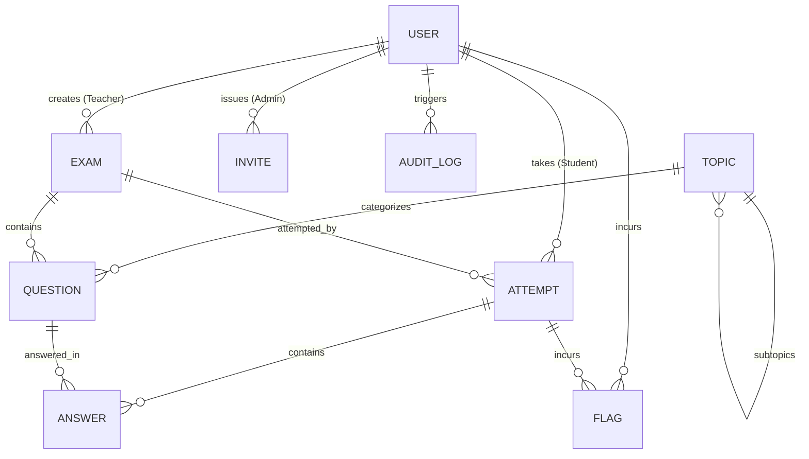

# Exam Platform — Database Schema Reference

This document describes the PostgreSQL database schema managed through Prisma for the Exam Platform.

---

## Entity Relationship Overview

---

## Data Models

### 1. `User`
Core user identity and role assignment.
* `id` (UUID, PK)
* `email` (String, Unique)
* `passwordHash` (String)
* `name` (String)
* `role` (Enum: `ADMIN`, `TEACHER`, `STUDENT`)
* `isActive` (Boolean, default true)
* `createdAt`, `updatedAt` (DateTime)

### 2. `Invite`
Tracks invitations issued by administrators before account activation.
* `id` (UUID, PK)
* `email` (String, Unique)
* `role` (Enum: `ADMIN`, `TEACHER`, `STUDENT`)
* `token` (String, Unique)
* `status` (Enum: `PENDING`, `ACCEPTED`, `EXPIRED`, `REVOKED`)
* `expiresAt` (DateTime)
* `invitedById` (UUID, FK $\rightarrow$ User)

### 3. `Topic`
Hierarchical category structure for curriculum-aligned question tagging and weakness analytics.
* `id` (UUID, PK)
* `name` (String, Unique)
* `description` (String, Optional)
* `parentId` (UUID, FK $\rightarrow$ Topic, Optional)

### 4. `Exam`
Assessment definition.
* `id` (UUID, PK)
* `title` (String)
* `description` (String, Optional)
* `durationMinutes` (Int)
* `startTime`, `endTime` (DateTime, Optional)
* `isPublished` (Boolean, default false)
* `isAdaptive` (Boolean, default false)
* `teacherId` (UUID, FK $\rightarrow$ User)

### 5. `Question`
Individual question in an exam.
* `id` (UUID, PK)
* `examId` (UUID, FK $\rightarrow$ Exam)
* `topicId` (UUID, FK $\rightarrow$ Topic, Optional)
* `text` (String)
* `type` (Enum: `MCQ`, `SUBJECTIVE`)
* `options` (JSON, Optional list of choices)
* `correctAnswer` (String, Optional)
* `rubric` (String, Optional rubric text for subjective AI grading)
* `difficulty` (Enum: `EASY`, `MEDIUM`, `HARD`)
* `points` (Float, default 1.0)
* `orderIndex` (Int)

### 6. `Attempt`
A student's exam session.
* `id` (UUID, PK)
* `studentId` (UUID, FK $\rightarrow$ User)
* `examId` (UUID, FK $\rightarrow$ Exam)
* `status` (Enum: `IN_PROGRESS`, `SUBMITTED`, `GRADED`, `EXPIRED`)
* `startedAt` (DateTime)
* `submittedAt` (DateTime, Optional)
* `score` (Float, Optional)
* `totalPoints` (Float, Optional)

### 7. `Answer`
An individual answer for a specific question in an attempt.
* `id` (UUID, PK)
* `attemptId` (UUID, FK $\rightarrow$ Attempt)
* `questionId` (UUID, FK $\rightarrow$ Question)
* `selectedAnswer` (String, Optional)
* `textAnswer` (String, Optional)
* `aiScore`, `teacherScore`, `finalScore` (Float, Optional)
* `timeSpentSeconds` (Int, default 0)
* `changeCount` (Int, default 0)
* `isFlagged` (Boolean, default false)

### 8. `Flag`
Security and anti-cheating signals.
* `id` (UUID, PK)
* `attemptId` (UUID, FK $\rightarrow$ Attempt)
* `studentId` (UUID, FK $\rightarrow$ User)
* `flagType` (Enum: `TAB_SWITCH`, `TIME_ANOMALY`, `SIMILARITY_MATCH`, `RAPID_GUESS`)
* `details` (JSON, Optional)
* `createdAt` (DateTime)

### 9. `AuditLog`
Administrative tracking for compliance and audit trail.
* `id` (UUID, PK)
* `userId` (UUID, FK $\rightarrow$ User, Optional)
* `action` (String)
* `entity` (String)
* `entityId` (String, Optional)
* `details` (JSON, Optional)
* `ipAddress`, `userAgent` (String, Optional)
* `createdAt` (DateTime)
